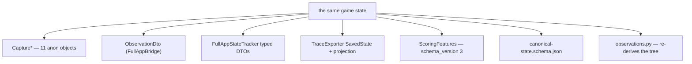
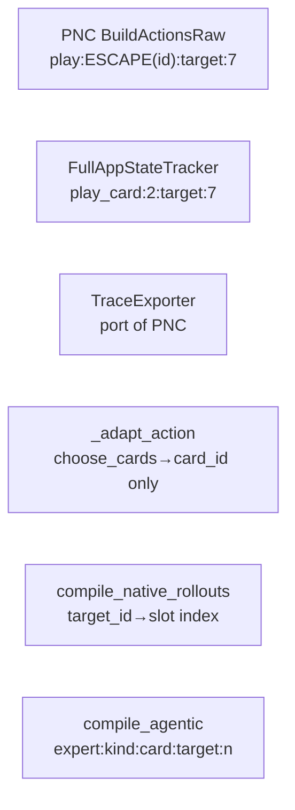
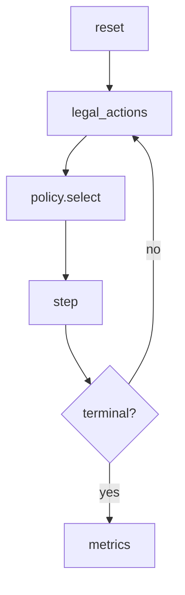

# Architecture review — divine-sts2

**rev 2 · 2026-09-15 · 13 candidates (7 Strong, 4 Worth exploring, 2 Speculative)**

Headless Slay the Spire 2 execution environment. 8 C# projects under `src/`, ~80 Python modules under `python/`.

Companion to `architecture-review.html` (same candidate numbers, same evidence, visual before/after diagrams there).

Hot spots were chosen by **commit frequency, not file size**. The last eight commits cluster on two areas:

- the macro/policy layer under `python/`
- reward / potion / room handling in `src/Sts2.NativeSim.Core/PersistentNativeCombatEnvironment.cs` — the most-committed file in the repository, and a single 3 268-line class

> **Repo state note.** There is no `CONTEXT.md` and no `docs/adr/` — a `docs: remove legacy design and status documents` commit cleared them. Candidate modules are therefore named from the code's own vocabulary, with no glossary to anchor them. Per `docs/agents/domain.md` this is noted rather than treated as a defect.

## Contents

| # | Candidate | Strength |
|---|-----------|----------|
| 1 | [Give the room-kind machines a seam](#1-give-the-room-kind-machines-a-seam) | Strong |
| 2 | [One observation contract, not seven](#2-one-observation-contract-not-seven) | Strong |
| 3 | [Collapse the two RPC dialects](#3-collapse-the-two-rpc-dialects) | Strong |
| 4 | [One policy seam instead of six](#4-one-policy-seam-instead-of-six) | Strong |
| 5 | [Make the package the interface](#5-make-the-package-the-interface) | Strong · **blocking** |
| 6 | [Collapse the duplicated host entry points](#6-collapse-the-duplicated-host-entry-points) | Strong |
| 7 | [One action identity](#7-one-action-identity) | Strong |
| 8 | [Let the worker's typed verbs go](#8-let-the-workers-typed-verbs-go) | Worth exploring |
| 9 | [Retire the parallel bootstrap in the probe](#9-retire-the-parallel-bootstrap-in-the-probe) | Worth exploring |
| 10 | [Make acceptance one module](#10-make-acceptance-one-module-and-give-parity-a-caller) | Worth exploring |
| 11 | [One scripts layer, not three](#11-one-scripts-layer-not-three) | Worth exploring |
| 12 | [One episode driver, not six](#12-one-episode-driver-not-six) | Speculative |
| 13 | [Retire the unbuilt probe and broken examples](#13-retire-the-unbuilt-probe-and-the-broken-examples) | Speculative |

[Top recommendation](#top-recommendation) · [Blocking defects](#blocking-defects-verified)

---

## Blocking defects (verified)

These are **not architecture** and are called out separately because four candidates below are their architectural cause. Each was reproduced directly, not inferred.

### B1 — The gate fails on the tree it gates

`scripts/test-public-tree.ps1:13-14` greps for `(C:\Users\|F:\SteamLibrary|ghp_[A-Za-z0-9_]+)` and **throws on exit 0**. The exact command:

```
$ git grep -n -E '(C:\Users\|F:\SteamLibrary|ghp_[A-Za-z0-9_]+)' -- .
Directory.Build.props:10:    <GameDataDir ...>F:\SteamLibrary\steamapps\common\Slay the Spire 2\data_sts2_windows_x86_64</GameDataDir>
tests/Sts2.NativeSim.TraceExporterSmoke/Sts2.NativeSim.TraceExporterSmoke.csproj:4:    <GameDataDir ...>F:\SteamLibrary\...>
$ echo $?
0
```

Both files are tracked. **CI is red on pristine main.** `.github/workflows/ci.yml:35` runs this script; `CONTRIBUTING.md:18` tells contributors to run it.

**Resolved.** The path scan now skips tracked markdown, so a document may quote the pattern and the
matches it produced — this finding was itself the third match, which is the whole reason for the
exemption — while the secret-token scan still covers every tracked file, because a credential in prose
is still a leak (ADR-0004). The hardcoded game paths are gone from `Directory.Build.props` and
`tests/Sts2.NativeSim.TraceExporterSmoke/Sts2.NativeSim.TraceExporterSmoke.csproj`: `GameDataDir`
derives from `STS2_GAME_ROOT` alone, and a project that references the shipped assemblies declares
`RequiresGameData` and fails with `STS2_GAME_ROOT is not set` rather than a missing-reference error.
`pwsh scripts/test-public-tree.ps1` exits 0 on this tree
(`.scratch/dev-environment-hardening/issues/03-public-tree-gate-and-hardcoded-defaults.md`).

### B2 — A documented command cannot import

`README.md:78` instructs users to run `python python/neural_turn_search.py`. That file imports, at `neural_turn_search.py:26-27`:

```python
from deck_transformer import CardVocab
from sts2_native_sim.v9_tokenizer import Sts2TokenEncoder
from sts2_native_sim.v9_transformer import Sts2SetTransformerCritic
```

None of the three exist. `python/sts2_native_sim/` contains only: `__init__, cli, client, full_app_client, gym, observations, parity, paths, scoring, search`. Same breakage at `neural_champion_policy.py:23-25` and `pure_neural_agent.py:23`.

### B3 — The learned policy path cannot import

`native_rollout_policy.py:23-32` imports:

| Imported | Exists |
|---|---|
| `combat_v1.vocab`, `combat_v1.encoder` | no |
| `combat_v5.model` | no |
| `train_v10_combat_policy` | no |
| `v12_combat_model` | no |
| `expert_combat_retriever` | yes |

All were deleted in `d6371e0` ("Repository cleanup: remove obsolete prototypes…"). Consequently `python/native_rollout_farm.py --policy learned` (gated at `:412-413`) raises `ModuleNotFoundError` at import, as does `run_a1_champion_benchmark.py:21`.

### B4 — A bundled example is provably wrong

`examples/02_mcts_search.py:19-23` calls:

```python
coordinator.search(reset_request=reset_request, max_depth=2, max_nodes=8)
```

The real interface, `python/sts2_native_sim/search.py:88-96`:

```python
def search(self, scorer, *, max_depth=2, node_budget=64, beam_width=8, source_worker_index=0)
```

No `reset_request`, no `max_nodes` → `TypeError`. It also reads `best_action` / `nodes_evaluated` / `duplicate_branch_hits`, none of which the return dict has. Neither `examples/` file is referenced by README, CONTRIBUTING or CI.

---

## How to read this

**Strength** — `Strong` (do it, high confidence), `Worth exploring` (real friction, shape needs a decision), `Speculative` (may be deliberate divergence).

**The deletion test** — for each candidate: if you deleted the module, would complexity *concentrate* somewhere (a real module earning its keep) or just *move* to callers (a pass-through)? A "concentrates" verdict is the signal.

Vocabulary is deliberate: **module**, **interface**, **implementation**, **depth**, **seam**, **adapter**, **leverage**, **locality**. Not "component", "service", "API", "boundary", "layer".

---

## 1. Give the room-kind machines a seam

**Strength:** Strong · in-process
**Files:** `src/Sts2.NativeSim.Core/PersistentNativeCombatEnvironment.cs` — 3 268 lines, one class, ~150 members, 858 `ReflectionTools` call sites

### Problem

The environment is an implicit sum type over ten room kinds. The same mode set is restated in three dispatch tables, the reset paths, and the `Branch` record:

| Site | Line | Keyed on |
|---|---|---|
| `StepAsync` | L228–266 | `action.Kind` string, 22 arms |
| `BuildActionsRaw` | L765–779 | `_runStage` + `_*Mode` booleans |
| `Capture` | L673–690 | same modes, **different order** |
| `Reset` | L167 | one 30-assignment statement |
| `RestoreAsync` | L327–335 | mode restore + history replay |
| `Branch` record | L3222 | 15-field hand-written projection |

Ten room kinds × four methods = **40 methods**, all following the same quartet:

```
Initialize<Room>()  ·  Build<Room>Actions()  ·  Choose<Room>Async()  ·  Capture<Room>()
```

Adding a room kind requires eight correct edits. Miss one and the state machine drifts silently.

`Branch` is *not* a complete projection of the sum type — it carries no treasure or shop state, because those are only reachable through `_runMode` and are recovered by history replay. That works, but it means the restore path's correctness depends on that invariant holding by hand.

### Solution

Put a four-method interface at a seam and make each room kind an adapter behind it:

```csharp
interface RoomKind {
    void Initialize(Environment env);
    IReadOnlyList<LegalAction> LegalActions(Environment env);
    Task Choose(Environment env, LegalAction action);
    object Capture(Environment env, object? transition);
}
```

The environment keeps session, branch, transport and hashing; room behaviour goes behind the seam.

```
BEFORE                              AFTER
┌──────────────────────────┐        ┌─────────────────────────────┐
│ StepAsync   (22 arms)    │        │ PersistentNativeCombatEnv   │
│ BuildActionsRaw (modes)  │        │  session·branch·transport   │
│ Capture     (modes)      │        ├─────────────────────────────┤
│ Reset / Restore / Branch │        │ ╭─ RoomKind (interface) ─╮  │
├──────────────────────────┤        │ │ map reward custom rest │  │
│ 40 room methods          │        │ │ event treasure shop …  │  │
└──────────────────────────┘        │ ╰────────────────────────╯  │
  3 tables hand-synced              └─────────────────────────────┘
                                          one dispatch site
```

### Wins

- locality: a room kind lives in one file
- three dispatch tables collapse to one
- the interface is the test surface
- room adapters testable without the game
- 15 mode fields stop leaking into `Branch`

### Deletion test

Deleting the 40 methods is impossible — but deleting the *duplication* concentrates: the mode set becomes owned by one interface instead of restated at eight sites. Currently complexity is **duplicated, not moved**.

---

## 2. One observation contract, not seven

**Strength:** Strong · local-substitutable
**Files:** `PersistentNativeCombatEnvironment.cs` (11 `Capture*` variants + `ScoringFeatures`) · `FullAppBridge/FullAppStateTracker.cs` · `Protocol/Messages.cs` · `FullAppBridge/ProtocolMessages.cs` · `schemas/canonical-state.schema.json` · `python/sts2_native_sim/observations.py`

### Problem

Seven independent encodings of one game state:



Three specific findings, all verified:

**(a) The published schema is already wrong.** `canonical-state.schema.json` sets `additionalProperties: false` and requires `combat` + `inventory`. But `CaptureMap` (L939) emits `map` and no `combat` — as do the reward, rest, event, treasure, shop, room-reward, custom-reward, act-transition and terminal variants. **Ten of eleven violate it.** Nothing validates: there is no `jsonschema` dependency (`pyproject.toml:13-17`), and the only consumer is `tests/test_public_smoke.py:14-18`, which parses it as JSON and asserts two constants.

**Resolved for the observation itself.** The schema is now v3: `combat` and `inventory` are optional, every run stage's block is described (including the ones that carry no combat block), the standalone blocks are described with them, and `jsonschema` is a dependency. `tests/test_observation_schema.py` validates captures recorded from the worker against it, so a capture that drifts fails a test instead of passing a parse. What remains of this finding is the rest of the solution below — typed observation records and a schema generated from them; the schema file is still hand-written and still the only description of the shape outside the C# capture sites.

**(b) Two mutually incomparable state hashes.**

| | PNC | FullAppStateTracker |
|---|---|---|
| Function | `ComputeStateHash` L662-671 | `ComputeHash` L445-454 |
| Payload | `hash_schema_version = 4` + observation + kernel snapshot | own `ObservationDto` |
| Schema pin | 4 | `SchemaVersion = 2` (L47) |

The two can never be compared — so "does the full-app bridge match the simulator" cannot be asked of the hashes at all. This quietly defeats the differential harness whose entire purpose is comparing the two encoders.

**(c) A fourth projection lives inside the environment.** `ScoringFeatures` (L1677-1713, with `ScoringCreature` L1715-1726 and `ScoringPile` L1728-1729) is RL value-net feature engineering carrying its own `schema_version = 3` (L1688), returned on every `EnvironmentResult` (set at L731). Nothing else in Core or Protocol knows its shape.

### Solution

Make typed observation records the single definition. Generate the JSON Schema from them. Validate at the Python seam on receive instead of re-deriving the tree. One hash function over one record type.

```
Observation records (typed, one file per variant)
  sealed interface RunObservation
    CombatObservation · MapObservation · RewardObservation · …
  ScoringFeatures — its own record, not an anonymous object
  ComputeHash(RunObservation) -> string
        │
        ├─▶ generate ─▶ JSON Schema ($defs per variant)
        └─▶ validate at the Python seam, then project
```

### Wins

- interface shrinks to one contract
- drift caught at the seam, not in playtests
- one comparable state hash
- seven definitions become one
- the schema stops being decoration

### Deletion test

Delete `ObservationDto`, the schema file, and the `ScoringFeatures` anonymous object: **nothing consolidates.** The `Capture*` anonymous objects are the only real definition and they are untyped. Six of the seven copies are pass-throughs; the one that is real cannot be checked.

**Interacts with candidate 1:** the `Capture*` family *is* the room-kind quartet, so a room-kind adapter can own its observation record.

---

## 3. Collapse the two RPC dialects

**Strength:** Strong · ports & adapters
**Files:** `src/Sts2.NativeSim.Protocol/Messages.cs` · `src/Sts2.NativeSim.FullAppBridge/ProtocolMessages.cs` · `python/sts2_native_sim/client.py` · `python/sts2_native_sim/full_app_client.py`

### Problem

Two incompatible envelopes for one protocol:

| | `Protocol` | `FullAppBridge` |
|---|---|---|
| `id` | `string` | `int` |
| result | `ok: bool` + `error: {code, message, details}` | `result` / `error: string` |
| legal action | `action_id`, `kind`, `parameters` | `action_id`, `action_type`, `description`, `metadata` |

Two hosts, two Python clients, two names for the same three fields. The Python clients are the same module written twice — `NativeWorker.request(method, params)` and `FullAppBridgeClient.call(method, params)`.

**`FullAppBridge.csproj` project-references `Sts2.NativeSim.Protocol` and then defines its own `ProtocolMessages.cs` anyway.** A reference nothing relies on.

**Errors lose their request id.** `FullAppBridgeServer.cs:104` answers with `Id = 0`, so a client cannot correlate a failure with its request. The native path preserves `request?.Id` (`Host/Program.cs:243`).

### Solution

One envelope, one legal-action shape; each host an adapter satisfying it.

```csharp
Request  { id, method, params }
Response { id, ok, result, error }
LegalAction { action_id, kind, parameters }
```

Two hosts mean **two real adapters** — the seam is justified, it is simply in the wrong place.

### Wins

- two clients become one transport
- `action_type` stops leaking into callers
- seam tested once covers both hosts
- error correlation restored

### Deletion test

Deleting `ProtocolMessages.cs` concentrates nothing on its own — the `FullAppBridge` types would move into `Protocol/Messages.cs` and the two clients would still speak different dialects. What concentrates is the *duplication*: `Protocol` is a real module that the full-app host **declines to use despite referencing it**. That declined reference is the tell — the seam was built and then bypassed, so the honest fix is to make the host satisfy it or drop the reference.

---

## 4. One policy seam instead of six

**Strength:** Strong · in-process
**Files:** `python/native_rollout_policy.py` · `empirical_a10_macro.py` · `agentic_macro_prior.py` · `native_outcome_macro_prior.py` · `a1_champion_policy.py` · `neural_champion_policy.py` · `neural_turn_search.py` · `train_a1_champion.py` · `pure_neural_agent.py` · `expert_combat_retriever.py`

### Problem

Six modules answer "what should I do next" with **four different interface shapes**:

| Module | Interface |
|---|---|
| `EmpiricalA10MacroPolicy` | 6 methods `(state, actions) -> str \| None` |
| `AgenticMacroPrior` | 7 methods `(obs, legal_actions) -> str \| None`; `select_shop(legal_actions)` takes no obs |
| `NativeOutcomeMacroPrior` | 1 method `select(state, actions) -> str \| None`, kind-blind |
| `A1ChampionController`, `NeuralChampionPolicy`, `PureNeuralAgent`, `DeterministicLegalPolicy` | `select_action(obs, legal_actions) -> str`, non-optional — raises instead of abstaining |

The composer, `native_rollout_policy.py:128-325`, is a ~200-line if-chain over seven decision kinds, each hand-ordering `native_macro → macro → empirical_macro` and returning a free-form `source` string no one validates.

**The implementations were deleted from git history** (see [B3](#b3--the-learned-policy-path-cannot-import)). The four `combat_architecture` branches (L86-124) and `_score_combat_v5` / `_score_combat_v12` are written against contracts whose only definitions now exist in git history — with no test asserting call shapes.

**`A1ChampionPolicyNet` is defined four times**, byte-identical `__init__`:

| File | Line | Role |
|---|---|---|
| `train_a1_champion.py` | :92 | writes `models/v9_a1_champion_macro.pt` (:187) |
| `a1_champion_policy.py` | :30 | loads it (:79) |
| `neural_champion_policy.py` | :35 | loads it (:118) |
| `neural_turn_search.py` | :85 | loads it (:287) |

Four identical edits or the checkpoint silently stops loading.

**Two further frictions the same seam fixes:**

- **Import-time singletons block testing.** `a1_champion_policy.py:325`, `pure_neural_agent.py:368`, `neural_champion_policy.py:293` construct singletons at import that immediately `torch.load` a checkpoint and read `artifacts/*.jsonl`. `native_rollout_policy.py:58` calls `torch.cuda.is_available()` at construction and hard-codes four repo paths at `:70-74`. There is no injection point for a fake state or fake model.
- **`ExpertCombatRetriever` infers on a schema it never trained on.** `select()` consults it *first*, before the neural scorer (`native_rollout_policy.py:468-471`). But `compile_examples` (`expert_combat_retriever.py:77-93`) reads the **full-app** schema (`obs["combat"]["enemies"]`, `enemy_id`, `metadata.target_id`) while `_query` (`:27-45`) reads the **native** schema (`scoring_features`, `combat_id`, `model_id`). `by_encounter` is keyed on native model ids, examples on full-app enemy ids, so the encounter lookup silently degrades to `by_count` (`:58`). It contributes an unverifiable decision to every combat turn.

### Solution

```python
select(state) -> Decision | None     # abstain by returning None
Decision: action_id, source
```

One adapter per prior, each declaring what it needs; compose them in one ordered list. Put the champion architecture in `sts2_native_sim/a1_champion.py` (train writes it, three policies read it). Take checkpoints and artifact paths as constructor arguments.

### Wins

- locality: architecture in one module
- 200-line if-chain becomes a list
- priors testable with no checkpoint
- schema mismatch becomes visible
- dead branches acquire an owner

### Deletion test

Deleting the singletons moves construction to three call sites — pass-through globals; removing them concentrates nothing but unblocks testing. Deleting `ExpertCombatRetriever` does not remove complexity — it moves an unverifiable decision source into `_score_combat`, so the fix is to correct its schema, not to delete it.

---

## 5. Make the package the interface

**Strength:** Strong · **blocking** · in-process
**Files:** `pyproject.toml:33-38` · `python/acceptance.py` · `python/full_act_bridge_acceptance.py` · `python/run_seeded_full_act_corpus.py` · 59 `sys.path.insert` calls across ~44 files

> Named "Make the package boundary real" in the HTML companion. Retitled here to keep the vocabulary clean.

### Problem

`pyproject.toml` packages only `sts2_native_sim*`:

```toml
[tool.setuptools.packages.find]
where = ["python"]
include = ["sts2_native_sim*"]
```

So **10 modules are packaged and ~80 are reachable only by `sys.path` order.** Three consequences:

**(a) Production pipelines import their policy from a test.**

| Caller | Imports | From |
|---|---|---|
| `densify_community_runs.py:22` | `select_policy_action` | `full_act_bridge_acceptance` (:30) |
| `generate_full_act_trajectories.py:32` | `select_policy_action` | same |
| `full_act_search_benchmark.py:17` | `choose_action, scenario` | `run_seeded_full_act_corpus` (:31, :17) |
| `search_coordinator_acceptance.py:9` | same | same |

Deleting one of those "tests" breaks two data-generation pipelines. They are not tests — they are an unowned library.

**(b) Shared domain data lives in a script.** `python/acceptance.py`'s only content is `DECK` / `SCENARIO` (`:8-14`). It is imported by **14 modules**, including `benchmark.py:6`, `latency_benchmark.py:6`, `stress_test.py:6`, and ten `run_*_acceptance.py`.

**(c) This is also where B2 and B3 belong.** Restoring `combat_v1` / `combat_v5` / `v12_combat_model` into `sts2_native_sim` — or deleting the dead branches that import them — is the same decision. The policy layer's implementations need an owner; today they have none.

### Solution

Move the shared scenario data, the acceptance harness and the shared policy into the package. Make tests callers of the library. Delete the 59 `sys.path.insert` shims.

```
BEFORE                              AFTER
sts2_native_sim/  (10 files)        sts2_native_sim/
  ── the only interface ──            client · observations · search
        │                             scoring · paths · gym
        │ sys.path order              scenarios/   ← DECK, SCENARIO, builders
        ▼                             acceptance/  ← harness, named asserts
python/*.py  (80 files)                     ▲
  "just import the sibling"                 │ plain imports
                                    tests/  ← callers of the library
```

### Wins

- interface is a package name
- 59 path shims deleted
- pipelines stop importing tests
- `pip install -e .` becomes sufficient
- unblocks testing everything else

### Deletion test

Deleting `paths.py`-style shared modules concentrates (call sites would each grow their own lists). Deleting the `sys.path` shims concentrates nothing but removes 80 modules' worth of ambiguity about which copy wins. This candidate is the **prerequisite** for 4, 10 and 12.

---

## 6. Collapse the duplicated host entry points

**Strength:** Strong · in-process
**Files:** `src/Sts2.NativeSim.Host/Program.cs` (258 lines) · `src/Sts2.NativeSim.GodotHost/Main.cs` (253 lines)

### Problem

Normalizing whitespace and dropping blanks: **179 of ~205 non-trivial lines are byte-identical** (verified with `Compare-Object`).

| Symbol | Program.cs | Main.cs |
|---|---|---|
| `ServeAsync` | L196-250 | L196-250 |
| `RunOptionChoiceAcceptanceAsync` | L61-131 | L62-132 |
| `RunTraceExporterSmokeAsync` | L133-194 | L134-194 |
| ~30-arm `request.Method switch` | included | included |

Only four differences: entry-point shape (top-level vs `Main._Ready`), `LoadResourcePack` (`Main.cs:35`), trace directory (`AppData\SlayTheSpire2` vs `OS.GetUserDataDir()`), and `attemptUnsafeAction` default (`Program.cs:47` `false` vs `Main.cs:53` hardcoded `true`).

**One copy is dead from every entry point.** The only caller of `--option-choice-acceptance` is `python/option_choice_acceptance.py:34`, which launches **Godot**. Nothing passes that flag to the .NET host. The expected result is restated a third time as Python literals at `option_choice_acceptance.py:45` (`bundle_choices 2, relic_actions 3, final_card_count 13, reconstructed_card_count 13`).

### Solution

Extract the dispatch table, the acceptance scenario and the trace smoke into a shared module. Leave each entry point responsible only for what genuinely differs (ALC setup, resource pack, trace directory).

### Wins

- the protocol seam exists once
- ~180 lines of duplication deleted
- acceptance contract in one place
- the dead copy stops being maintained

### Deletion test

Neither file can be deleted (both are entry points), but the duplication is **pure loss** — complexity is literally doubled, not moved. Removing it concentrates the protocol in one module. This is the **fastest win** in the review: contained, mechanical, no redesign.

---

## 7. One action identity

**Strength:** Strong · in-process
**Files:** `native_rollout_policy.py:430-465` · `compile_native_rollouts.py:73-89` · `compile_agentic_combat_supervision.py:55-108` · `FullAppStateTracker.cs:108-125` · `PersistentNativeCombatEnvironment.cs:787-788` · `AutoTraceDriverMod.cs:139-153`

### Problem

Six encodings of "what is this action":



Same action ⇒ **different `action_id` string**, different `metadata` keys, and different target semantics (**raw combat id vs enemy slot index**). Corpora compiled by different scripts are indexed on incomparable keys; the join simply misses, and nothing reports the mismatch.

**Four separate target-selection rules:** PNC's per-creature `IsValidTarget` scan (L788), `FullAppStateTracker`'s `OrderBy(CombatId)` (L108), `AutoTraceDriverMod`'s `OrderBy(CombatId).FirstOrDefault()` (L145), and `FullAppBridgeMod`'s silent fallback (L210-219) — different tie-breaks, different failure modes.

**Opposite legality contracts, same ids:**

| Path | Behaviour on unknown target |
|---|---|
| `FullAppBridgeMod.cs:212-213, 245-246` | falls back to `HittableEnemies.FirstOrDefault()` — acts on a **different enemy** |
| `FullAppBridgeMod.cs:326-331` | ad-hoc 1-based/0-based heuristic, then `branchIdx = 0` — silently takes the first map node |
| PNC (`:849`, `:854-858`) | throws `ProtocolException("invalid_action", …)` |

A policy trained against the full-app path learns that illegal actions are quietly repaired; the same action id against PNC throws.

### Solution

```csharp
ActionId { kind, card_id, target_id }   // target_id is a combat id, never a slot
encode(ActionId) -> string              // one function
resolve(ActionId) -> entity             // throws, never guesses
```

The canonical answer already exists — it is the C# host's `legal_actions`. Three Python copies are re-deriving it and none owns it. Make each host an adapter that produces the one identity; the compilers consume it.

### Wins

- corpora become joinable
- one legality contract, not two
- illegal actions fail loudly instead of acting on the wrong enemy
- one target-selection rule
- three Python encodings deleted

### Deletion test

Deleting any one copy concentrates nothing — the other two still disagree. This concept is **unowned**, which is exactly why it has six encodings.

---

## 8. Let the worker's typed verbs go

**Strength:** Worth exploring · in-process
**Files:** `python/sts2_native_sim/client.py` (`NativeWorker`, 35 methods) · `PersistentNativeCombatEnvironment.cs` (8 reset + 7 step verbs)

### Problem

| Layer | Methods | Line range |
|---|---|---|
| `*_reset` | 8 | `client.py:210-236` |
| `*_observe` | 6 | `:240-249` |
| `*_step` | 7 | `:252-272` |

Twenty-one of thirty-five are one-line pass-throughs to `self.request("<name>", …)`, each also doing the same `_record_reset` / history-append / `_remember_handle` bookkeeping. `request()` is already the seam.

Nothing enforces pairing: `rest_reset` followed by `map_step` is indistinguishable at the interface level. Callers must memorise 21 RPC names, and ~20 acceptance scripts each encode one valid pairing.

```
BEFORE                          AFTER
interface ████████████ 35       interface ███  request
impl      ██████████████ 21      impl      ██████████████  transport,
          of 35 are pass-throughs                        framing, recycling
```

### Solution

Collapse to `reset(kind, …)` / `step(kind, …)` driven by one declarative kind table shared with the C# side.

### Wins

- interface shrinks by two thirds
- one verb table, both languages
- reset/step pairing becomes checkable

### Deletion test

**Not deletable.** Deleting outright pushes raw RPC strings into 20+ callers and *increases* caller complexity. The typed verbs are the only place the verb vocabulary is written down on the Python side. The deepening is the `kind` parameter, which keeps call-site arity and concentrates the method-name table where the complexity already is.

---

## 9. Retire the parallel bootstrap in the probe

**Strength:** Worth exploring · in-process
**Files:** `src/Sts2.NativeSim.Core/NativeFeasibilityProbe.cs` — 1 001 lines, 235 reflection call sites · `PersistentNativeCombatEnvironment.cs` · `FullAppBridge/PresentationSuppression.cs`

### Problem

Three implementations of native bootstrap and presentation suppression:

| Probe | Environment | FullAppBridge |
|---|---|---|
| `InitializeModelDb` :84 | `InitializeOnce` :344 | `PresentationSuppression.Apply` :12-52 |
| `InitializeLocalization` :98 | `Construct` :353 | patches every void on `VfxCmd`, `NDebugAudioManager`, `SfxCmd`, `ThinkCmd` :82-87 |
| `InstallHeadlessPresentationSeam` :109 | `InstallSeam` :2077 | no state check |
| `ConstructNativeRun` :222 | — | swallows every failure :105-108 |
| `ConstructNativeCombat` :301 | — | never counts patched methods |
| `ExtractCanonicalObservation` :513 | `Capture*` :673-1920 | |
| `ExtractLegalActions` :662 | `BuildActionsRaw` :765 | |

All three define their own `SkipTask` / `SkipVoid` / `ForceSkipVisuals` / `HeadlessManualCardPlay` Harmony patch bodies.

**Three failure modes for one policy.** A new void, state-bearing `SfxCmd` method is:
- **silently suppressed** in the full-app path (`FullAppBridge/PresentationSuppression.cs`)
- **throws** in the probe path (`InvalidOperationException("State-bearing SfxCmd method: …")` at `:129`, `:137`, `:146`)
- **skipped** in PNC (patches only voids / returns `null`)

`PresentationSuppression` also never counts patched methods, so a silently-empty patch set is indistinguishable from success.

### Solution

Extract bootstrap, the Harmony seams and one documented suppression policy into a shared module. Leave the probe responsible only for feasibility-specific checks.

### Wins

- locality: assembly knowledge in one place
- one suppression policy, one failure mode
- 1 093 reflection sites share a home
- the probe tests the environment instead of a copy

### Deletion test

Deleting the probe concentrates **nothing** — the bootstrap knowledge simply stays duplicated in the environment. That is the shape of a module earning nothing at the seam it sits on: a second implementation, not an adapter. The probe is a historical artefact (a one-shot investigation of whether headless execution was possible), which explains but does not justify keeping it live.

---

## 10. Make acceptance one module, and give parity a caller

**Strength:** Worth exploring · local-substitutable
**Files:** `python/*_acceptance.py` — 22 files, ~1 725 lines · `python/sts2_native_sim/parity.py` (**dead**) · `python/differential_replay.py` · `tests/`

### Problem

Quantified across the 22 acceptance files:

| Measure | Count |
|---|---|
| Bare `assert` statements | **207** |
| `assert len({s["state_hash"] for s in …}) == 1` (the same determinism check), across 12 files | **38** |
| Files printing their own `{"success": true, …}` JSON | **20 of 22** |
| `pool.map(...)` sites | 48 |
| `restore(...)` sites | 35 |

Each re-inserts `sys.path` and rolls its own scenario. The nearest thing to a shared helper is local and unnamed: `run_composed_utility_rooms_acceptance.py:41-55` (`step_all`, `finish_combat`).

**CI sees three files.** `.github/workflows/ci.yml:27` runs `pytest -q` over `tests/` — `test_observations.py`, `test_public_smoke.py`, `test_search.py`, ~4.9 KB total. The 22 acceptance files are never collected.

**`parity.py` has no callers.** `compare_snapshots` and `build_trust_matrix` are unreferenced, while `differential_replay.py:29,51` rolls its own `first_difference` / `first_subset_difference` for the same job. The seam exists; nothing stands on it.

**The one offline test pins a shape production never produces.** `tests/test_search.py:6-15` builds `reset_request = {"character": …, "seed": …}`, but production writes `{"method": …, "params": …}` (`client.py:238`, read back at `search.py:12-15`). It pins sort-key stability of a fabricated dict and never asserts the real identity keys.

### Solution

```python
drive(pool, spec, policy) -> Trace
assert_workers_agree(states)
assert_restore_roundtrip(worker, handle)
```

One harness owning scenario construction, driving and named determinism assertions. Per-room scripts become thin cases over it. Route snapshot comparison through `parity.py`.

### Wins

- the interface is the test surface
- 38 unnamed asserts become 3 named ones
- the dead parity module earns its keep
- acceptance becomes one command
- 12 path bootstraps deleted

### Deletion test

Deleting any single script concentrates nothing — pool setup, scenario and the determinism assertion reappear in the next file. **Twenty-two shallow test modules, no module.**

These need a licensed game install, so they cannot run in public CI as-is. Collecting them under pytest behind a marker makes the acceptance surface *visible* and makes `pytest -m native` the one local command — which does not currently exist.

---

## 11. One scripts layer, not three

**Strength:** Worth exploring · local-substitutable
**Files:** `scripts/common.ps1` · `python/sts2_native_sim/paths.py` · `python/option_choice_acceptance.py:12-27` · `scripts/{show-godot-stage-summary,test-godot-determinism,benchmark-godot-workers}.ps1`

### Problem

**Discovery is implemented twice in two languages, plus a third inline copy:**

| `scripts/common.ps1` | `python/sts2_native_sim/paths.py` |
|---|---|
| `Get-DivineRepositoryRoot` :3-16 | `REPOSITORY_ROOT` |
| `Get-DivineDotnet` :3-16 | `find_dotnet` :92-95 |
| `Get-DivineGameRoot` :18-54 — Steam `libraryfolders.vdf` regex :39 | `_steam_roots` :21-43 — **the same regex at :41** |
| `Get-DivineGameAssembly` :56-62 | `find_game_assembly` |
| `Get-DivineGodot` :64-72 | `find_godot` |

Version pins are copied widely: the Godot version string appears at `paths.py:143-144`, `common.ps1:67`, `option_choice_acceptance.py:16`, `install-godot-4.5.1.ps1:8`. The `.tools/dotnet9` root is re-derived at `paths.py:93-94`, `common.ps1:8`, `cli.py:32`, `client.py:106-108`, `option_choice_acceptance.py:22`.

`option_choice_acceptance.py:12-27` does its own Godot `rglob`, its own three-way GodotHost project search and its own `.tools/dotnet9` lookup — then imports `find_game_assembly` from `paths.py` two lines later.

**The one-shot worker report contract is parsed three times in PowerShell:**

| Script | Lines |
|---|---|
| `show-godot-stage-summary.ps1` | :20-41 |
| `test-godot-determinism.ps1` | :20-46 — as `Invoke-NativeSimWorker` |
| `benchmark-godot-workers.ps1` | :24-53 |

Identical `ProcessStartInfo` block, identical async stdout/stderr drain, identical `NATIVE_SIM_REPORT_BEGIN\s*(\{.*\})\s*NATIVE_SIM_REPORT_END` regex, identical "report markers were not found" throw. All three also independently `dotnet build` GodotHost Debug.

The marker contract is emitted at `Host/Program.cs:48-50` and `GodotHost/Main.cs:54` and documented nowhere. Python's only one-shot consumer uses a **different** convention — scanning for a line starting `{"success"` (`option_choice_acceptance.py:44`).

### Solution

Make `paths.py` the single discovery policy with the PowerShell layer as a thin caller. Add one `Invoke-NativeSimReport` owning the marker contract.

### Wins

- one place to bump a version pin
- ~60 lines of PowerShell deleted
- one report parser, one convention
- leverage: N scripts, 2 interfaces

### Deletion test

`common.ps1` is genuine but thin — four functions, all used by eight dot-sourcing scripts, so deleting it would move ~20 lines into each of eight files. The friction is **not shallowness**: it is that `common.ps1` and `paths.py` are two implementations of one policy. The missing `Invoke-NativeSimReport` is a genuine pass-through gap: for the long-lived JSON-line worker a real helper exists (`client.py:65`, `:334`, used by 18 of 22 acceptance scripts), but for one-shot report mode there is none.

---

## 12. One episode driver, not six

**Strength:** Speculative · in-process
**Files:** `native_rollout_farm.py` · `comprehensive_benchmark.py` · `run_seeded_full_act_corpus.py` · `generate_full_act_trajectories.py` · `soak_test_20_workers.py` · `latency_benchmark.py` · `benchmark.py`

### Problem



That loop is implemented in **six modules**. Duplicated alongside it:

| Duplication | Sites |
|---|---|
| `_timed` / `_timed_after` | `comprehensive_benchmark.py:92,101` · `latency_benchmark.py:12,18` — same two functions, same signature |
| `PolicyDecision` | `native_rollout_policy.py:40` · `native_rollout_farm.py:39` — identical frozen dataclass |
| `DECK_TEMPLATES` | `comprehensive_benchmark.py:41-65` ≡ `soak_test_20_workers.py:26-50` — byte-identical |
| 8-scenario catalog | `benchmark_rl_rollout_engine.py:122-210` vs `test_scenarios_validation.py:8-86` — same 8 names, **already drifted**: `choice_and_generation` is a 5-card deck on one side and 7 on the other |
| Portable branch replay | `client.py:357-367` · `native_fitness_champion.py:41-50` · `benchmark_rl_rollout_engine.py:757-767` — three copies, all reaching for private `_record_reset` / `_history` |
| Scenario payload builders | ≥9 independent constructors re-listing the same ~13 keys |

Inbound references: only `soak_test_20_workers.py` (`README.md:66`) and `native_rollout_farm.py` (`README.md:72`). `comprehensive_benchmark.py`, `benchmark.py`, `latency_benchmark.py`, `stress_test.py` have zero. The `README.md:21-25` throughput numbers can come from either path and are never cross-checked, so the two implementations are free to disagree.

### Solution

```python
drive(pool, spec, policy, limit) -> Episode
summarize(episodes) -> Metrics
restore_portable(worker, branch)    # the only branch replay
```

`Policy` is the candidate-4 seam. `spec` is candidate 5's scenario record.

### Wins

- leverage: 6 callers, 1 interface
- two timing helpers deleted
- one `PolicyDecision`, one scenario builder
- replay semantics stop drifting

### Deletion test

Marked **Speculative** because these are research instruments: each answers a different question and some divergence is deliberate. Deepen only after candidate 4 lands the policy seam, otherwise the driver would have to accept four policy shapes.

**The exception that can happen now:** consolidating `restore_portable`. `benchmark_rl_rollout_engine.py:760-764` hand-rolls it (`portable["reset_request"]`, `w2.request(...)`, `w2._record_reset(...)`, then `w2.step` per history entry) purely so it can time each phase. Replacing it with the real call adds no caller complexity — the stopwatch stays. This is the clearest "would concentrate" case in the repo, and it also stops the private reach-through at `:884`, `:911`, `:918` (`pool._replace_if_dead`).

---

## 13. Retire the unbuilt probe and the broken examples

**Strength:** Speculative
**Files:** `tools/Sts2.NativeSim.ApiProbe/Program.cs` · `examples/01_basic_gym_loop.py` · `examples/02_mcts_search.py` · `src/Sts2.NativeSim.AutoTraceDriver`

### Problem

Four artefacts advertise support that does not exist:

| Artefact | State | Evidence |
|---|---|---|
| `tools/Sts2.NativeSim.ApiProbe/Program.cs` | **unbuilt** | 26-line reflection dumper; **not in `Sts2.NativeSim.sln`**; `grep ApiProbe` matches only itself |
| `src/Sts2.NativeSim.AutoTraceDriver` | **unlisted** | a whole project missing from `Sts2.NativeSim.sln`, which lists exactly 7: Core, Protocol, Host, GodotHost, TraceExporter, TraceExporterSmoke, FullAppBridge. `dotnet build Sts2.NativeSim.sln` silently skips it |
| `examples/02_mcts_search.py` | **broken** | see [B4](#b4--a-bundled-example-is-provably-wrong) |
| `tests/Sts2.NativeSim.TraceExporterSmoke/` | **misnamed** | under `tests/` but is not a test: 10 lines, no assertions, no exit code. In the `.sln`, so `run-feasibility.ps1:10` builds it. Duplicates the `--trace-exporter-smoke` mode in both hosts (`Program.cs:133`, `Main.cs:134`) |

None is referenced by README, CONTRIBUTING or CI as a command a maintainer should run.

**Related, and relevant to testability:** there is **no C# test project at all** — no xunit/nunit/MSTest reference anywhere. The only C#-level exercise of the choice machinery reaches into private fields by reflection: `Host/Program.cs:69-80` and `GodotHost/Main.cs:70-81` call `GetMethod("Mutable", NonPublic)`, `GetField("_player")`, `GetMethod("StartTransitionAsync")`, plus `Main.cs:148` `GetField("_combat")`. So the acceptance harness breaks on any private rename, silently, and only runs against an installed game.

The constructor (`PersistentNativeCombatEnvironment.cs:75-85`) mutates process-global state (singleton at `:77-78`, `InstallSeam` at `:2077-2191`, `InstallSaveMock` at `:2061-2069`), so no instance can exist in a test host. Genuinely pure functions are nonetheless unreachable: `ComputeStateHash` (`:662-671`), `EnumerateSelections` (`:2494-2507`), `ValidateSelection` (`:2552-2556`), `ResolveBranchHistory` (`:2633-2638`). `ReflectionTools` is `internal` (`:10`), so no test assembly can reach it without `InternalsVisibleTo`.

### Solution

- **Delete** `ApiProbe` — complexity vanishes (a scratchpad with no consumer)
- **Delete** the broken example — it cannot run
- **Add `AutoTraceDriver` to the `.sln`**, or record why it is deliberately excluded
- **Rename** `TraceExporterSmoke` — it is a diagnostic tool, not a test

### Wins

- navigation signals become true
- `tests/` means tests
- the solution builds everything it claims
- no dead scratchpads

### Deletion test

Deleting `ApiProbe` concentrates nothing (complexity vanishes). Deleting the broken example removes two unverified files. Worth doing despite being small because **an agent or new contributor uses `tests/`, `tools/` and `examples/` as signals of what is supported — and three of those signals are false.** Making them honest is precisely the AI-navigability this review is for.

---

## Top recommendation

### 1 · Do this first — [Make the package the interface](#5-make-the-package-the-interface)

It is a **prerequisite, not a preference**. Only `sts2_native_sim` is packaged, so ~80 sibling modules are reachable by `sys.path` order rather than an interface — and [B2](#b2--a-documented-command-cannot-import) and [B3](#b3--the-learned-policy-path-cannot-import) are the same defect seen from other angles: a documented command imports deleted modules, two production pipelines import their policy from a file named `*_acceptance.py`, and shared scenario data lives in a script.

Every other candidate assumes you can import and exercise the code. Candidate 4 cannot be tested while policy modules construct singletons that `torch.load` at import; candidate 10 cannot become a command while the harness is spread across 22 scripts; candidate 1's room-kind adapters cannot be reached without a game. Fix the interface and the rest becomes testable.

### 2 · Biggest deepening — [Give the room-kind machines a seam](#1-give-the-room-kind-machines-a-seam)

Highest leverage available: one interface replaces three hand-synced dispatch tables in the most-committed file in the repository. It also unblocks 2, 7 and 10, whose work naturally lands on room-kind adapters.

### 3 · Fastest win — [Collapse the duplicated host entry points](#6-collapse-the-duplicated-host-entry-points)

179 of 205 non-trivial lines are a verbatim copy. Contained, mechanical, no redesign, ~180 lines deleted.

### Out of band

[**B1**](#b1--the-gate-fails-on-the-tree-it-gates) — `scripts/test-public-tree.ps1:13-14` — is a gate that **failed CI on every clean checkout**. It is not architecture, and it did not wait for architecture: it was fixed on its own, ahead of any work in this review (see the resolution note in B1 and ADR-0004).

---

## Appendix — deletion-test verdicts

| Candidate | Verdict |
|---|---|
| 1 room-kind machines | **concentrates** — mode set owned by one interface instead of eight sites |
| 2 observation contract | **concentrates** — six of seven copies are pass-throughs; the real one is untyped |
| 3 RPC dialects | **concentrates** — one envelope, two legitimate adapters |
| 4 policy seam | **concentrates** — four shapes, one concept; singletons are pass-through globals |
| 5 package interface | **concentrates** — 80 modules with no interface become one |
| 6 host entry points | **concentrates** — complexity is literally doubled today |
| 7 action identity | **unowned** — deleting any copy leaves the others disagreeing |
| 8 worker typed verbs | **not deletable** — deleting increases caller complexity; collapse instead |
| 9 probe bootstrap | **just moves** — deleting leaves the duplication in the environment |
| 10 acceptance | **concentrates** — 22 shallow test modules, no module |
| 11 scripts layer | **concentrates** (report helper); `common.ps1` is thin, not shallow |
| 12 episode driver | **concentrates** (`restore_portable` now); rest is Speculative |
| 13 dead artefacts | **complexity vanishes** — no consumer |

### Additional observation with no candidate

Six incompatible value scales answer "how good is this native state", and nothing reconciles them: dense shaping in `sts2_native_sim/gym.py:146-154`; `NativeObservedMaterialScorer.__call__` (`scoring.py:126-137`); terminal ±1 000 000 (`scoring.py:198-199`); `native_fitness_champion.combat_fitness:29-38`; `train_native_value_matrix.terminal_return:119-127`; `compile_native_rollouts.episode_return:40-49`. "Fitness" means six different things in six artifacts. Left uncandidated because the right owner is unclear — but it is the same unowned-concept shape as candidate 7.
